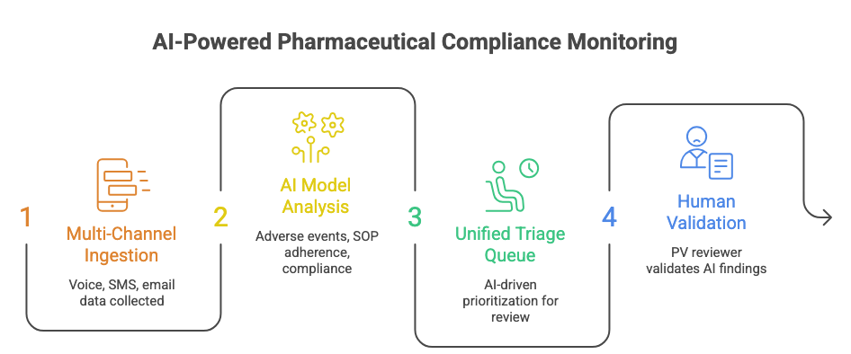
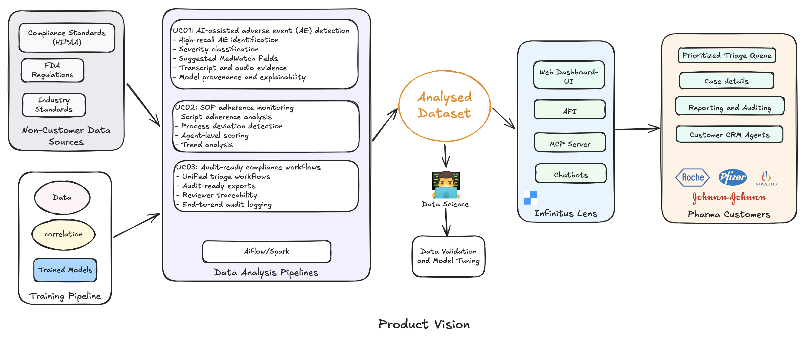
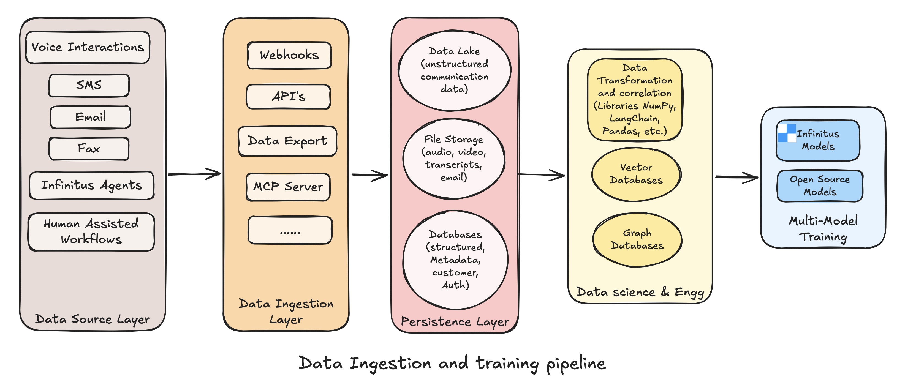
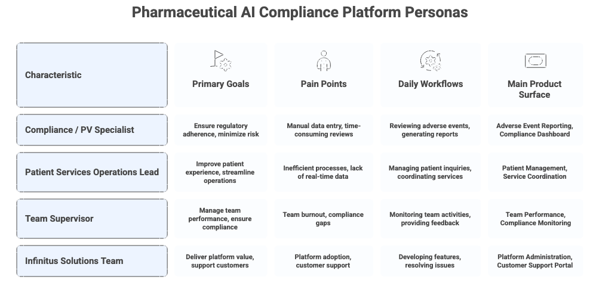
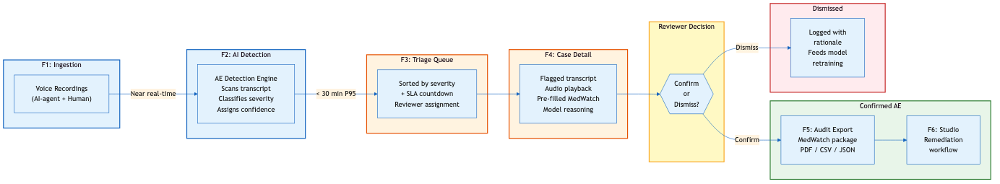
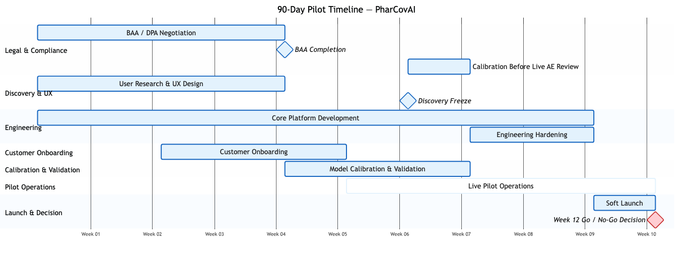

# PharCovAI: An Ideation Paper for AI-Powered Pharmacovigilance at the Company

**Author:** Poorva Mittal

**Document Type:** Idea Paper & Timeline Execution Plan

---

## Table of Contents

1. [Executive Summary](#1-executive-summary)
2. [The Compliance Blind Spot](#2-the-compliance-blind-spot)
   - [The Scale of What's Missed](#the-scale-of-whats-missed)
   - [The Failure Chain](#the-failure-chain)
   - [The AI Governance Vacuum](#the-ai-governance-vacuum)
   - [Fragmented Audit Landscape](#fragmented-audit-landscape)
3. [From 5% to 100%: The Product Vision](#3-from-5-to-100-the-product-vision)
   - [The Shift](#the-shift)
   - [Data Sources](#data-sources)
   - [Core Product Outputs](#core-product-outputs)
   - [Design Principles](#design-principles)
   - [What This Is Not](#what-this-is-not)
4. [Why Now — The Strategic Moat](#4-why-now--the-strategic-moat)
   - [The Spending Problem](#the-spending-problem)
   - [Why Now — Four Converging Signals](#why-now--four-converging-signals)
   - [The Platform Moat](#the-platform-moat)
   - [Why Not Someone Else?](#why-not-someone-else)
5. [Target Users & Personas](#5-target-users--personas)
   - [Economic Buyer](#economic-buyer)
   - [Primary Users](#primary-users)
6. [MVP Feature Prioritization](#6-mvp-feature-prioritization)
   - [V1 — MVP Features](#v1--mvp-features)
   - [V1.5 Features](#v15-features)
   - [V2 Features](#v2-features)
   - [Deferred / Long-Term Features](#deferred--long-term-features)
7. [Product Experience](#7-product-experience)
   - [Primary Workflow](#primary-workflow)
   - [Core Product Surfaces](#core-product-surfaces)
8. [From Contract to First Case Review](#8-from-contract-to-first-case-review)
   - [Why Pharma Onboarding Is Different](#why-pharma-onboarding-is-different)
   - [Onboarding Phases](#onboarding-phases)
   - [The First Value Moment](#the-first-value-moment)
9. [Pilot Launch Plan](#9-pilot-launch-plan)
   - [Pilot Design](#pilot-design)
   - [Parallel Execution Tracks](#parallel-execution-tracks)
10. [How We'll Know It's Working](#10-how-well-know-its-working)
    - [Safety Metrics](#safety-metrics)
    - [Product Quality Metrics](#product-quality-metrics)
    - [Business Metrics](#business-metrics)
11. [The Week 12 Decision](#11-the-week-12-decision)
    - [Go Criteria](#go-criteria)
    - [Conditional Go — Retry with Improvements](#conditional-go--retry-with-improvements)
    - [No-Go Triggers](#no-go-triggers)
    - [What Happens After Each Outcome](#what-happens-after-each-outcome)
12. [The Case for Building This](#12-the-case-for-building-this)
    - [The Strategic Argument](#the-strategic-argument)
    - [The Cost of Inaction](#the-cost-of-inaction)
    - [The Post-Pilot Roadmap](#the-post-pilot-roadmap)
    - [The Ask](#the-ask)

---

## 1. Executive Summary

Pharmaceutical manufacturers carry regulatory responsibility for every patient and provider interaction occurring across their support ecosystem. However, most conversations remain unreviewed due to the limitations of manual Quality Assurance (QA) processes.

Current workflows review only 1–5% of conversations, leaving critical compliance, pharmacovigilance (PV), and operational risks undetected. Studies consistently estimate that only 5–10% of adverse drug reactions are reported through spontaneous reporting systems (Hazell & Shakir, *Drug Safety*, 2006), meaning the vast majority of safety signals are missed before they ever reach regulators. With the FDA requiring serious AE reports within 15 calendar days — and penalties for non-compliance including warning letters, consent decrees, and fines reaching into the hundreds of millions — the cost of delayed detection is both regulatory and financial.

The global pharmacovigilance market is valued at **$10.36 billion in 2025** and is projected to reach **$22.25 billion by 2034** (8.88% CAGR), with AI-driven automation emerging as a key growth driver. Platforms like EVERSANA's AI-powered PV solution have demonstrated up to 50% faster operations with 40% less manual effort — validating market readiness for intelligent compliance tooling.

As AI agents become increasingly embedded into patient support operations, regulators are sharpening their focus on AI governance. The FDA's evolving framework for AI/ML in drug development and post-market safety — alongside the EU AI Act's classification of healthcare AI as high-risk — signals that companies deploying AI agents without centralized monitoring will face growing scrutiny.

This proposal introduces a compliance intelligence extension built on top of AI Lens to enable:

- **UC01:** AI-assisted adverse event (AE) detection
- **UC02:** SOP adherence monitoring
- **UC03:** Audit-ready compliance workflows
- **UC04:** Unified multi-channel conversation review
- **UC05:** Human-in-the-loop regulatory decision making

The proposed MVP focuses on high-recall AE detection and triage workflows for pharmaceutical compliance teams. The 90-day pilot targets ≥97% AE recall with <4-minute median reviewer time-to-decision, leveraging the Company's existing conversation infrastructure and Lens analytics platform.

## 2. The Compliance Blind Spot

### The Scale of What's Missed

Pharmaceutical patient support programs generate tens of thousands of interactions monthly — across calls, SMS, email, and AI-agent conversations. Yet manual QA teams typically staff 1 reviewer per 500–1,000 calls, creating a structural bottleneck that leaves the vast majority of conversations unevaluated.

What's not reviewed is not triaged, not flagged, and not auditable. Every unreviewed conversation is a potential unreported adverse event, an undetected SOP deviation, or an audit gap waiting to surface.

### The Failure Chain

When an adverse event is mentioned in a patient call, the current process depends on the agent recognizing it in real time and escalating manually. The typical failure chain looks like this:

1. A patient mentions a symptom or side effect during a support call
2. The agent — human or AI — either misses the signal or logs it inconsistently
3. The interaction enters a QA backlog where it may never be sampled for review
4. The AE goes unreported, potentially breaching FDA's 15-day reporting window
5. The gap is only discovered during an audit — weeks or months later

With the FDA's FAERS database receiving over 2 million adverse event reports annually and growing, the volume of reportable interactions is increasing while the manual review model remains fixed.

### The AI Governance Vacuum

AI agents now handle a growing share of patient support interactions — scheduling, benefits verification, prescription status, and triage. Yet most organizations have no centralized mechanism to monitor what an AI agent said, whether it followed the approved script, or whether it surfaced a potential adverse event correctly.

When an AI agent deviates from protocol, there is no automated alert, no audit trail tied to the conversation, and no feedback loop to the compliance team. The result is a governance gap that widens with every new AI-handled interaction.

### Fragmented Audit Landscape

Compliance teams preparing for FDA inspections or internal audits typically reconcile data across 4–6 disconnected systems — telephony platforms, CRM tools, email archives, QA spreadsheets, and PV case management databases. This manual reconciliation can consume 2–4 weeks of preparation per audit cycle, pulling senior staff away from active compliance monitoring.

## 3. From 5% to 100%: The Product Vision

### The Shift

| | Today | With PharCovAI |
| --- | --- | --- |
| **Conversations reviewed** | 1–5% (manual QA sampling) | 100% (algorithmic + human oversight) |
| **AE detection method** | Agent self-reporting, random audits | High-recall AI flagging with evidence |
| **Time to flag** | Days to weeks (if ever) | Minutes (P95 target: <30 min) |
| **Audit readiness** | Weeks of manual reconciliation | Continuous, export-ready |
| **AI agent oversight** | None | Centralized governance and scoring |

The vision is to transition pharmaceutical customers from manually reviewing approximately 5% of conversations to algorithmically evaluating 100% of interactions — while maintaining human oversight for all regulatory determinations. No AI system makes a final compliance call; every flagged event routes to a human reviewer with full transcript evidence, model reasoning, and suggested MedWatch fields.

### Data Sources

The solution extends AI Lens into a compliance intelligence platform capable of analyzing conversations across every channel in the patient support ecosystem:

- Voice conversations
- SMS interactions
- Email communications
- AI-agent interactions
- Human-assisted workflows

### Core Product Outputs

#### Adverse Event Detection — *for PV Specialists*

The primary use case. AI models scan every conversation for potential adverse events, classify severity, and pre-populate MedWatch fields. Reviewers see the flagged transcript segment, audio evidence, and model confidence score — enabling a determination in under 4 minutes instead of 15–20 minutes of manual review.

#### SOP Adherence Monitoring — *for Operations Leads*

Every conversation is scored against customer-specific scripts and process checklists. Deviations are flagged at the agent level, enabling targeted coaching instead of blanket retraining. Trend dashboards surface systemic issues before they become compliance events.

#### Compliance Governance — *for Compliance Leadership*

The connective layer that makes everything audit-ready. Every AI flag, reviewer decision, and escalation is logged with timestamps and user identity. Export packages are generated in formats aligned to FDA inspection requirements.

### Design Principles

These principles govern trade-offs throughout the product:

1. **Recall over precision** — It is better to over-flag and let a reviewer dismiss than to miss a reportable event. The system optimizes for ≥97% recall even at the cost of higher false positives (<20% target).
2. **Human-in-the-loop for all regulatory determinations** — AI assists; humans decide. No adverse event is reported or dismissed without a reviewer's explicit action.
3. **Audit trail by default** — Every system action — AI flag, reviewer decision, configuration change — is logged immutably. Audit readiness is not a feature; it is an architectural constraint.
4. **Channel-agnostic analysis** — The compliance engine treats voice, SMS, email, and AI-agent interactions through a unified pipeline. Adding a new channel should not require rebuilding the analysis layer.

### What This Is Not

To keep scope sharp and the 90-day timeline achievable, the product deliberately excludes:

- **Not a real-time agent coaching tool** — Analysis is post-conversation, not in-call. Real-time monitoring requires a fundamentally different low-latency architecture (see F12 in Deferred Features).
- **Not an automated FDA submission system** — The product surfaces and packages reportable events but never submits to regulators without human authorization (see F13 in Deferred Features).
- **Not a general-purpose call center analytics platform** — No sentiment scoring, customer satisfaction metrics, or handle-time optimization. The product is purpose-built for pharmaceutical compliance and pharmacovigilance.

## 4. Why Now — The Strategic Moat

### The Spending Problem

Pharma companies are already spending on this problem — they're just spending poorly. Compliance teams either rely on manual QA processes that cover a fraction of interactions, or they procure general-purpose conversation analytics tools designed for call center efficiency, not pharmacovigilance. A growing number are attempting to build internal tooling, but these efforts are slow, expensive, and compete for engineering resources against core product priorities.

The opportunity is not to create new spend — it is to redirect existing compliance and QA budgets toward a solution that actually closes the gap.

### Why Now — Four Converging Signals

1. **AI agents are entering regulated conversations at scale.** Patient support programs are rapidly deploying AI agents, and each AI-handled interaction creates a new compliance surface without corresponding oversight (see Section 2: The AI Governance Vacuum).

2. **LLM capabilities have crossed the accuracy threshold.** Advances in medical NLP, entity extraction, and multi-turn conversation understanding have made high-recall AE detection (≥95%) achievable without overwhelming reviewers with noise.

3. **Regulators are signaling intent.** The FDA's evolving AI/ML framework, the EU AI Act's high-risk classification for healthcare AI, and increasing FDA scrutiny of AI-generated patient interactions all point in one direction: companies deploying AI in patient-facing roles will need to demonstrate centralized monitoring and audit readiness.

4. **the Company already has the infrastructure.** This is not a cold start. the Company already processes healthcare conversations at scale, serves a significant share of the Fortune 50 healthcare market, and covers over a thousand therapies. The delta between current capabilities and a compliance intelligence product is an extension — not a greenfield build. The specific numbers are detailed in the Moat table below.

### The Platform Moat

the Company's advantage is not a single feature — it is a compounding set of barriers that are difficult to replicate:

| Advantage | What It Means | The Numbers |
| --- | --- | --- |
| **Data moat** | Historical conversation datasets across pharma patient support programs that no competitor can access | Hundreds of millions of minutes of conversation automated; millions of calls processed; hundreds of therapies covered. A new entrant starts from zero. |
| **Infrastructure reuse** | HIPAA-compliant conversation ingestion, storage, and processing already exist at scale | Millions of patients supported; thousands of providers' workflows impacted; broad payor coverage nationwide. A competitor would need 12–18 months to replicate. |
| **Customer trust** | Existing pharma relationships with BAA, security review, and vendor qualification already complete | A significant share of the healthcare Fortune 50 and Fortune 100 are customers. For a new vendor, qualification alone takes 6–12 months. |
| **Domain expertise** | Team understands healthcare conversation workflows at a depth generic vendors cannot match | 300+ system improvements shipped in 6 months; customers see 10% increase in data accuracy and 50% ROI vs. manual processes. |

### Why Not Someone Else?

Pharma compliance teams evaluating this space face three paths:

| Path | Timeline | Gap |
| --- | --- | --- |
| **Build internally** | 12–18 months | Diverts engineering, ongoing maintenance, no shared learnings across customers |
| **Buy generic** (Observe.AI, CallMiner, NICE) | Weeks to deploy | Not healthcare-native: no HIPAA architecture, no PV taxonomy, no MedWatch integration, no AI-agent governance |
| **Extend with AI Lens** | 90-day pilot | Leverages all four moat advantages (see above) from Day 1 |

The "extend" path is uniquely available through the Company because the foundational layers detailed in the Moat table already exist. Competitors would need to build them from scratch.

## 5. Target Users & Personas

### Economic Buyer

**Compliance Leadership** — VP/Head of Pharmacovigilance or Compliance; owns regulatory risk, audit readiness, and vendor procurement decisions.

### Primary Users

The diagram below details each persona's goals, pain points, daily workflows, and the product surface they interact with most:

## 6. MVP Feature Prioritization

### V1 — MVP Features

The MVP is scoped around one principle: **deliver a complete AE detection workflow before expanding to adjacent use cases.** Every feature in V1 serves the same user (PV Specialist), the same channel (voice), and the same outcome (a reviewable, audit-ready adverse event case).

F1–F6 form a dependency chain — each feature is useless without the one before it:

- No detection without ingestion (F1 → F2)
- No reviewer workflow without detection (F2 → F3, F4)
- No audit readiness without reviewer decisions (F3, F4 → F5)
- No remediation without a case to act on (F3 → F6)

Anything outside this chain — SOP scoring, multi-channel support, PV system integration — adds value but doesn't complete the core workflow. Those ship in V1.5 after the pilot validates the foundation.

| ID | Feature | Description | Why |
| --- | --- | --- | --- |
| F1 | Voice Call Ingestion | Ingest AI-agent and human conversation recordings | Dominant channel; no ingestion = no data to analyze |
| F2 | AE Detection Engine | High-recall adverse event classification | FDA 15-day mandate makes missed AEs the top risk |
| F3 | Case Queue | Reviewer workflow with severity-based prioritization | 100% coverage needs structured triage for reviewers |
| F4 | Case Detail View | Transcript, audio evidence, and MedWatch extraction | Consolidates evidence and MedWatch in one surface |
| F5 | Audit-Ready Export | Regulatory export package generation | Prerequisite for customer compliance sign-off |
| F6 | Studio Integration | Closed-loop remediation workflow | Closes detection-to-action loop via Studio |

### V1.5 Features

| ID | Feature | Description | Why |
| --- | --- | --- | --- |
| F7 | SOP Scoring | Script adherence monitoring | Next-priority use case (UC02) after AE detection |
| F8 | SMS & Email Ingestion | Multi-channel conversation support | Closes channel coverage gap beyond voice (UC04) |
| F9 | PV System Integration | Structured data export into PV systems | Eliminates manual re-entry into existing PV systems |

### V2 Features

| ID | Feature | Description | Why |
| --- | --- | --- | --- |
| F10 | Fax Intake Bridge | OCR ingestion and analysis | Completes full-channel coverage for compliance teams |
| F11 | Multilingual Support | Spanish-language support | Expands addressable market; equitable coverage |

### Deferred / Long-Term Features

| ID | Feature | Reason Deferred | Why |
| --- | --- | --- | --- |
| F12 | Real-Time Monitoring | Requires separate low-latency architecture | Batch analysis delivers 90%+ value within 90 days |
| F13 | Automated FDA Submission | Regulatory risk requires phased rollout | Human-in-the-loop (UC05) must be proven first |

## 7. Product Experience

### Primary Workflow

The MVP is designed around a reviewer-centric compliance workflow.

### Core Product Surfaces

#### 1. Triage Queue

Severity-prioritized case list with reviewer assignment, confidence scoring, and SLA countdown — optimized for one job: deciding the order of case handling.

#### 2. Case Detail View

Highlighted transcript with audio cued to the detection timestamp, pre-populated MedWatch fields, and confirm/dismiss/escalate actions — every decision audit-logged with reviewer identity and timestamp.

## 8. From Contract to First Case Review

### Why Pharma Onboarding Is Different

Standard SaaS onboarding assumes: sign contract, provision accounts, go live. Pharma compliance onboarding cannot follow this model. Before a single conversation flows through the system, three things must be true:

1. **Legal clearance** — BAA and DPA agreements must be fully executed. Pharma legal teams review these with the same rigor as clinical trial agreements. This alone can take 4–8 weeks if not started early.
2. **Data trust** — The system must demonstrate accurate detection on the customer's *own* conversation data, not generic test sets. Compliance teams will not adopt a tool that hasn't been calibrated against their specific therapy areas and AE language patterns.
3. **Workflow fit** — Reviewers must see the product as accelerating their existing workflow, not replacing it. If the triage queue doesn't match how they already prioritize cases, adoption will stall regardless of accuracy.

### Onboarding Phases

| Phase | Duration | Activities | Gate to Next Phase |
| --- | --- | --- | --- |
| Pre-Contract | 2–4 weeks | BAA/DPA negotiation, therapy area scoping, compliance team alignment, success criteria definition | Signed BAA/DPA + agreed scope |
| Technical Setup | 1–2 weeks | SSO configuration, RBAC provisioning, Lens integration, data pipeline validation | Data flowing through pipeline |
| Calibration | 2–3 weeks | AE model tuning on customer data, threshold adjustment, false positive review with compliance team | Detection recall ≥95% on customer data |
| Soft Launch | 1–2 weeks | Production dry-run on live conversations, reviewer training, parallel operation alongside existing QA | Reviewers completing cases independently |
| Steady State | Ongoing | Governance cadence (weekly → biweekly → monthly), model performance reviews, threshold recalibration | — |

### The First Value Moment

The most critical point in onboarding is **the first time a reviewer opens a real case flagged by PharCovAI on their own data.** If the reviewer says "yes, this is a real signal I would have missed" — adoption follows. If it doesn't, no amount of dashboard polish will overcome skepticism.

Target: **first value moment within 5–7 weeks of contract signature.**

## 9. Pilot Launch Plan

### Pilot Design

| Category | Scope |
| --- | --- |
| Duration | 4-week live pilot |
| Participants | 2 existing the Company pharma customers |
| Programs | 1 therapy program per customer |
| Channels | Voice-only for MVP |
| Weekly Volume | ~3,000 conversations per partner |
| Review Team | 2 PV analysts per partner |

### Parallel Execution Tracks

| Track | Timeline |
| --- | --- |
| Discovery & UX | Weeks 1–4 |
| Engineering | Weeks 1–9 |
| Legal & Compliance | Weeks 4–5 |
| Pilot Operations | Weeks 7–12 |

## 10. How We'll Know It's Working

The pilot scorecard is organized into three tiers, and they are not equal:

1. **Safety Metrics** — Non-negotiable gates. If any safety metric fails, the pilot stops. These protect patients and the Company's regulatory exposure.
2. **Product Quality Metrics** — Optimization targets. Misses here trigger engineering iteration, not pilot termination.
3. **Business Metrics** — Commercial signals measured at pilot end. They inform the commercialization decision, not the safety decision.

### Safety Metrics

| Metric | Target | Why This Target |
| --- | --- | --- |
| AE Recall Rate | ≥97% | At ~6,000 calls/week, even 3% missed events could mean dozens of unreported AEs. 97% balances safety with model feasibility. |
| Reporting Timeliness | 100% within FDA windows | Zero tolerance — a single late report is a compliance violation. The system must never be the bottleneck. |
| Coverage Rate | ≥99.5% | Every conversation must be analyzed. 0.5% tolerance accounts for ingestion errors, not intentional skips. |
| Misconfiguration Incidents | Zero | A misconfigured threshold or routing rule could suppress real AEs. No margin for error. |

### Product Quality Metrics

| Metric | Target | Why This Target |
| --- | --- | --- |
| Precision | ≥70% | Reviewers can tolerate ~30% false positives without workflow fatigue. Below 70%, the queue becomes noise and adoption drops. |
| Reviewer Agreement | ≥75% | Measures whether AI flags align with reviewer judgment. Below 75%, reviewers lose trust in the system's prioritization. |
| False Positive Rate | <20% | Inverse of precision floor. Above 20%, reviewer time is wasted on non-events, undermining the efficiency promise. |
| Time-to-Flag | <30 minutes P95 | Conversations must be analyzed and flagged within 30 minutes of ingestion. Longer delays compress the reviewer's SLA window. |

### Business Metrics

| Metric | Target | Why This Target |
| --- | --- | --- |
| Reviewer Time-to-Decision | <4 minutes | Baseline manual review takes 15–20 min. A 4x improvement demonstrates clear workflow value. |
| Reviewer NPS | ≥+20 | Reviewers are the daily users — if they don't advocate for the tool, renewal is unlikely. +20 indicates positive adoption. |
| Paid Conversion | Both partners by Week 14 | Two paying customers validates commercial viability and provides reference accounts for expansion. |
| Expansion Intent | Additional therapy programs | Expansion within existing customers is the lowest-friction growth path and signals the product delivers enough value to scale. |

## 11. The Week 12 Decision

At the end of Week 12, a Go / No-Go review is held with the Company leadership and pilot partner compliance leads. The outcome is one of three paths:

### Go Criteria

The pilot proceeds to commercialization if:

- AE recall ≥97% on customer data
- No confirmed production AE misses
- Reviewer time-to-decision <4 minutes median
- Both partners commit to commercial expansion
- Compliance counsel approves export workflows

### Conditional Go — Retry with Improvements

If most criteria are met but 1–2 non-safety metrics fall short, the pilot enters a 4-week remediation cycle rather than terminating:

| Condition | Example | Remediation |
| --- | --- | --- |
| Recall meets threshold but precision is low | Recall ≥97% but precision at 60% (target: ≥70%) | Retune model thresholds; reduce false positives with reviewer feedback loop |
| Reviewer efficiency is close but not there | Time-to-decision at 5 min (target: <4 min) | UX iteration on case detail view; streamline MedWatch field pre-population |
| One partner commits, other is undecided | Commercial signal is mixed | Extend pilot by 2 weeks for undecided partner; use committed partner as reference |
| Reviewer NPS is lukewarm | NPS at +12 (target: ≥+20) | Targeted workflow fixes based on reviewer feedback; re-survey after changes |

**Conditional Go rules:**
- Safety metrics (recall, timeliness, coverage, misconfiguration) must ALL pass. No Conditional Go for safety failures.
- Maximum one Conditional Go cycle. If metrics still miss after remediation, the decision becomes binary: Go or No-Go.
- Remediation plan must be specific — named fixes, owners, and a Week 16 re-evaluation date.

### No-Go Triggers

The pilot terminates if:

- Recall rates fall below 93% (safety floor)
- Any confirmed production AE miss occurs
- False-positive rates exceed 30% (reviewer workflow breaks down)
- Reviewer trust deteriorates to the point of non-adoption
- Regulatory sign-off is blocked by compliance counsel
- Production compliance failures occur

### What Happens After Each Outcome

| Outcome | Next Steps |
| --- | --- |
| **Go** | Convert partners to paid; begin V1.5 planning; publish internal case study for sales |
| **Conditional Go** | 4-week remediation with specific fixes; re-evaluate at Week 16 as binary Go/No-Go |
| **No-Go** | Post-mortem; preserve data and model weights; communicate transparently with partners; re-evaluate in 6 months |

## 12. The Case for Building This

### The Strategic Argument

Three things are true simultaneously, and this combination is rare:

1. **The market is spending but underserved.** Pharma companies are allocating compliance budgets to tools that don't solve the actual problem. The $10B+ pharmacovigilance market is growing at ~9% CAGR, but no healthcare-native, AI-powered compliance intelligence platform exists today.
2. **the Company is uniquely positioned.** No other company combines healthcare-native infrastructure, pharmacovigilance-specific capabilities, and existing pharma customer relationships. These advantages would take a competitor 18–24 months to replicate.
3. **The window is time-bounded.** The convergence of AI agent adoption, LLM accuracy thresholds, and regulatory signaling creates a narrow window. The company that establishes the governance layer during this adoption wave becomes the default.

### The Cost of Inaction

If the Company does not build this:

- **Customers will build internally.** Large pharma companies with engineering resources will invest in custom compliance tooling. Once built, switching costs make them unlikely to adopt an external product later.
- **Generic platforms will add surface-level compliance features.** They won't be healthcare-native, but they'll be "good enough" to capture budget and block new entrants.
- **The AI governance window closes.** Once pharma companies have a compliance solution in place — even a mediocre one — the urgency to evaluate alternatives drops dramatically.

### The Post-Pilot Roadmap

| Quarter | Phase | What Happens |
| --- | --- | --- |
| Q1 (Months 1–3) | **Pilot** | Build MVP, onboard 2 partners, validate AE detection |
| Q2 (Months 4–6) | **Commercialize** | Convert partners to paid, close 2–3 new customers, begin V1.5 |
| Q3 (Months 7–9) | **Expand** | Launch V1.5 (SOP scoring, SMS/email, PV integration), expand within customers |
| Q4 (Months 10–12) | **Scale** | Launch V2 (fax, multilingual), build sales playbook, establish customer advisory board |

Within 24 months, PharCovAI becomes the **system of record for AI-enabled pharmacovigilance and compliance operations** across the Company's pharma customer base — analyzing millions of conversations monthly, across all channels and languages, with demonstrated regulatory acceptance and audit defensibility.

### The Ask

To proceed, this initiative requires:

| Need | Detail |
| --- | --- |
| **Engineering allocation** | Dedicated team of 4–6 engineers for 12 weeks |
| **Data science support** | 1–2 ML engineers for AE model development and calibration |
| **Pilot partner commitment** | Executive sponsorship to engage 2 existing pharma customers |
| **Legal fast-track** | Priority BAA/DPA review — Week 1 start, not queued |
| **Go/No-Go authority** | Named decision-maker for the Week 12 review |
